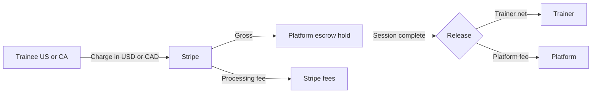

# NetQwix — Payment Processing Fees, Taxes & Break-Even Pricing

**Status:** Policy & implementation spec (design document)  
**Last updated:** 2026-05-28  
**Markets:** **United States (USA)** and **Canada (CA)** only  
**Applies to:** `nq-backend-main`, `nq-frontend-main`, `nq-mobile`  
**Payment provider:** Stripe (Connect + PaymentIntents + Stripe Tax)

---

## 1. Purpose

This document defines how NetQwix calculates **checkout totals in the USA and Canada** so every transaction covers:

1. **Stripe processing fees** (varies by country, payment method, and card origin)
2. **Sales tax / GST-HST-PST-QST** (based on the buyer’s state or province)
3. **Platform operating costs** (live sessions, storage, PDF/video, API/socket infra)
4. **Trainer payout** (the list price the trainer set, e.g. **$100 USD/hr** or **$135 CAD/hr**)
5. **NetQwix margin** (commission / service fee)

**Scope:** All pricing, quotes, PaymentIntents, escrow splits, storage plans, and tax logic must resolve through a **`region`** of `US` or `CA`. No other countries in this spec.

---

## 2. Regional model (USA + Canada)

### 2.1 Supported regions

| Region | Country code | Currency | Minor unit | Stripe account | Wallet (today) |
|--------|--------------|----------|------------|----------------|----------------|
| **USA** | `US` | **USD** | cents (¢) | US platform account | Enabled |
| **Canada** | `CA` | **CAD** | cents (¢) | CA platform account *or* US account with CAD charges* | Disabled (enable at launch) |

\* Prefer a **Canadian Stripe account** (or Stripe multi-currency setup) so domestic CAD cards settle in CAD without FX markup. Verify with your Stripe dashboard.

### 2.2 How region is determined

| Priority | Source | Used for |
|----------|--------|----------|
| 1 | Trainee billing address country (`US` / `CA`) | Tax jurisdiction, currency, fee table |
| 2 | Trainee profile `country` / `region` | Fallback quote |
| 3 | Trainer list-price currency | Trainer must publish in region currency |
| 4 | `DEFAULT` → `US` / USD | Legacy users |

**Rule:** A trainee in Canada always checks out in **CAD**. A trainee in the USA always checks out in **USD**. Cross-border sessions (US trainer, CA trainee) use **trainee region currency**; FX conversion of trainer list price happens at quote time using admin FX rate or trainer-set dual pricing.

### 2.3 Trainer list pricing by region

| Mode | Description |
|------|-------------|
| **Single currency** | Trainer sets hourly rate in home country currency only |
| **Dual list (recommended)** | Trainer sets `hourly_rate_usd` and `hourly_rate_cad` independently |
| **FX auto-convert** | One base rate × daily `USD/CAD` admin rate (display “approx.” until checkout) |

---

## 3. Current system (as implemented)

| Area | Current behavior | Target (this doc) |
|------|------------------|-------------------|
| Payment methods (web) | `card`, `amazon_pay`, `cashapp`, `link` + Apple/Google Pay | Region-filtered (see §5) |
| Stripe PI | `automatic_payment_methods`; amount = trainer price − promo | Quote total incl. fees + tax |
| Commission | Escrow ~15%; admin default 5% | Unify; same % both countries |
| Escrow | USD holds | USD or CAD holds by region |
| Storage | USD only ($3 / $5 / $10) | USD + CAD list prices (§10) |
| Tax | Not implemented | Stripe Tax US + CA |
| `supportedCurrencies` | `usd`, `eur`, `gbp` | Add **`cad`**; restrict checkout to `usd` / `cad` |

Code refs: `src/helpers/stripe.ts`, `escrowService.ts`, `src/config/wallet.ts`, `src/config/storage.ts`.

---

## 4. Money flow (escrow — both countries)



Stripe deducts processing from the **platform Stripe balance**. Commission must cover processing **or** processing is passed to the trainee (recommended).

---

## 5. Payment methods by country

### 5.1 United States — enabled methods

| Method ID | UI label | Variable fee | Fixed fee (USD) | Notes |
|-----------|----------|--------------|-----------------|-------|
| `card_domestic_us` | US credit / debit card | **2.90%** | **$0.30** | `card.country === 'US'` |
| `card_international_us` | Non-US card on US charge | **4.40%** | **$0.30** | 2.9% + 1.5% intl surcharge |
| `apple_pay_us` | Apple Pay | *inherit card* | *inherit* | Underlying card rate |
| `google_pay_us` | Google Pay | *inherit card* | *inherit* | Underlying card rate |
| `link_us` | Link | **2.90%** | **$0.30** | Same as domestic unless intl card |
| `amazon_pay_us` | Amazon Pay | **2.90%** | **$0.30** | Web only |
| `cashapp_us` | Cash App Pay | **2.90%** | **$0.30** | **US only** |
| `wallet_us` | NetQwix Wallet | **0%** | **$0.00** | Fee taken at top-up |
| `wallet_mixed_us` | Wallet + card | Prorated | Prorated | Card rate on card portion only |

*Source: [Stripe US pricing](https://stripe.com/us/pricing) — confirm on your dashboard contract.*

### 5.2 Canada — enabled methods

| Method ID | UI label | Variable fee | Fixed fee (CAD) | Notes |
|-----------|----------|--------------|-----------------|-------|
| `card_domestic_ca` | Canadian credit / debit card | **2.90%** | **C$0.30** | `card.country === 'CA'` |
| `card_international_ca` | Non-CA card on CAD charge | **3.70%** | **C$0.30** | 2.9% + 0.8% intl surcharge |
| `apple_pay_ca` | Apple Pay | *inherit card* | *inherit* | |
| `google_pay_ca` | Google Pay | *inherit card* | *inherit* | |
| `link_ca` | Link | **2.90%** | **C$0.30** | |
| `interac_ca` | Interac (if enabled) | **2.90%** | **C$0.30** | Enable in Stripe CA dashboard |
| `wallet_ca` | NetQwix Wallet | **0%** | **C$0.00** | When `regionCurrency.CA` enabled |
| `wallet_mixed_ca` | Wallet + card | Prorated | Prorated | |

**Not available in Canada (disable in Elements / Payment Sheet):** `amazon_pay`, `cashapp`.

*Source: [Stripe Canada pricing](https://stripe.com/en-ca/pricing) — confirm on dashboard.*

### 5.3 FX / currency-conversion surcharge

| Scenario | Stripe extra fee | NetQwix rule |
|----------|------------------|--------------|
| US account charges **CAD** card | +**2%** conversion | Avoid — use CA Stripe account |
| CA account charges **USD** card | +**2%** conversion | Avoid — charge trainee in CAD |
| Presentment = settlement currency | **0%** | **Always** present in local currency |

---

## 6. Processing fee formulas

All math in **minor units** (¢).

```
processingFeeMinor = round(chargeBaseMinor × variableRate) + fixedFeeMinor
```

**Charge base (recommended):** `sessionSubtotal + platformServiceFee` (after promos).

**Gross-up** (trainer must receive exact net):

```
totalMinor = ceil((chargeBaseMinor + fixedFeeMinor) / (1 - variableRate))
processingFeeMinor = totalMinor - chargeBaseMinor - taxMinor
```

### 6.1 When rate is known

| Stage | Action |
|-------|--------|
| Quote (pre-PM) | Default **domestic card** for trainee region |
| PM attached | Re-quote if intl card detected; reject if delta > tolerance |
| Wallet-only | Zero processing at checkout |

---

## 7. Sales tax — United States

### 7.1 Engine

**Stripe Tax** with US registrations. Enable `automatic_tax: { enabled: true }` on PaymentIntent.

Collect: **street, city, state, ZIP**, country `US`.

### 7.2 US tax types

| Type | Applies to |
|------|------------|
| **State sales tax** | 45 states + DC (rates vary 0%–10.25%+) |
| **Local tax** | City/county/district (e.g. RTD, MTA) |
| **Marketplace facilitator** | NetQwix may owe tax on **platform fee** and **trainer services** in states where registered |

### 7.3 Sample US combined rates (2025 reference — Stripe Tax is authoritative)

| State | Example locality | Combined rate | Notes |
|-------|------------------|---------------|-------|
| **Texas** | Austin | **8.25%** | No state income tax; common benchmark |
| **California** | Los Angeles | **9.50%** | High local variance |
| **New York** | NYC | **8.875%** | |
| **Florida** | Miami-Dade | **7.00%** | |
| **Washington** | Seattle | **10.25%** | |
| **Oregon** | Portland | **0%** | No general sales tax |
| **Delaware** | — | **0%** | |
| **Montana** | — | **0%** | |
| **New Hampshire** | — | **0%** | |
| **Alaska** | Anchorage | **0%** state | Local only |

### 7.4 US product tax codes (Stripe Tax)

| Line item | Tax code | Typical treatment |
|-----------|----------|-------------------|
| Live coaching session | `txcd_20030000` | Taxable in many states (live digital service) |
| Platform / marketplace fee | `txcd_10000000` | Taxable where nexus |
| Storage subscription | `txcd_10103000` / `10103001` | SaaS — state-specific |
| Digital clip | `txcd_30011000` | Digital goods |
| Processing fee pass-through | `txcd_10000000` | Often taxable when service is |
| Wallet top-up | — | **Non-taxable** (stored value) |

> CPA review required for marketplace facilitator registration by state.

---

## 8. Sales tax — Canada

### 8.1 Engine

**Stripe Tax** with **Canadian tax registrations** (GST/HST account + provincial where required).

Collect: **street, city, province, postal code**, country `CA`.

### 8.2 Canadian tax structure

| System | Provinces | Rate | Administered by |
|--------|-----------|------|-----------------|
| **GST** | All provinces | **5%** | CRA |
| **HST** (GST + provincial combined) | ON, NS, NB, NL, PE | **13%–15%** | CRA |
| **GST + PST** | BC, SK, MB | **5% + 6–7%** | CRA + province |
| **GST + QST** | Quebec | **5% + 9.975% ≈ 14.975%** | CRA + Revenu Québec |

### 8.3 Province reference table (2025 — confirm annually)

| Province / territory | Code | Tax type | Total rate |
|----------------------|------|----------|------------|
| **Alberta** | AB | GST only | **5%** |
| **British Columbia** | BC | GST + PST | **12%** (5 + 7) |
| **Manitoba** | MB | GST + PST | **12%** (5 + 7) |
| **New Brunswick** | NB | HST | **15%** |
| **Newfoundland & Labrador** | NL | HST | **15%** |
| **Northwest Territories** | NT | GST only | **5%** |
| **Nova Scotia** | NS | HST | **15%** |
| **Nunavut** | NU | GST only | **5%** |
| **Ontario** | ON | HST | **13%** |
| **Prince Edward Island** | PE | HST | **15%** |
| **Quebec** | QC | GST + QST | **14.975%** |
| **Saskatchewan** | SK | GST + PST | **11%** (5 + 6) |
| **Yukon** | YT | GST only | **5%** |

### 8.4 Canadian product tax treatment

| Line item | Typical treatment |
|-----------|-------------------|
| Live coaching / training | Taxable — **B2C** services in province of consumption |
| Platform fee | Taxable when NetQwix registered for GST/HST |
| SaaS / storage subscription | Taxable in most provinces |
| Digital goods / clips | Taxable |
| Wallet top-up | **Non-taxable** stored value |
| Processing fee pass-through | Taxable if underlying service is taxable (province-specific) |

> Register for GST/HST when revenue exceeds **C$30,000** small-supplier threshold (or register voluntarily). QST separate in Quebec.

---

## 9. Platform session fees (trainee + trainer)

Each **live session** (scheduled booking, instant lesson, session extension) includes **two flat platform fees**, both default **$0.50 USD / C$0.50 CAD** (admin-editable):

| Fee | Charged to | When | Checkout line item? |
|-----|------------|------|---------------------|
| **Trainee platform fee** | Trainee | Added to PaymentIntent / wallet debit | **Yes** — "Platform fee" |
| **Trainer platform fee** | Trainer | Deducted from trainer payout at escrow release | **No** — internal split |

These flat fees are **in addition to** the admin-configurable **% commission** on the session subtotal.

```
trainerNetMinor = sessionSubtotalMinor − round(sessionSubtotalMinor × commissionRate) − trainerPlatformFeeMinor
platformRevenue = platformFeePercentMinor + traineePlatformFeeMinor + trainerPlatformFeeMinor − processingFeeMinor − cogsMinor
```

> The trainer $0.50 is **not** a second charge on the trainee's card — it reduces what the trainer receives after the session completes.

---

## 10. Platform commission & COGS (both countries)

### 10.1 Commission (same rate both countries)

Priority: trainer `commission` → `admin_setting.commission` → default **15%** sessions.

```
platformFeeMinor = round(sessionSubtotalMinor × commissionRate)
trainerNetMinor  = sessionSubtotalMinor - platformFeeMinor - trainerPlatformFeeMinor
```

### 10.2 COGS floor (internal — USD reference; scale CAD by FX or separate config)

| Product | US COGS (USD) | CA COGS (CAD) | Drivers |
|---------|---------------|---------------|---------|
| Live 1:1 session / hr | $0.15 – $0.75 | C$0.20 – C$1.00 | Signaling, API, Redis |
| Group class / seat-hr | $0.10 – $0.50 | C$0.15 – C$0.65 | Fan-out |
| Session PDF / game plan | $0.02 – $0.10 | C$0.03 – C$0.13 | S3 |
| Clip storage / GB-mo | ~$0.023 | ~C$0.031 | S3 ca-central-1 |
| Wallet ledger / txn | $0.01 | C$0.01 | DB + audit |

```
minCommissionRate = (processingFeeMinor + cogsMinor) / sessionSubtotalMinor
```

Enforce on backend at PI creation.

---

## 10. Product catalog — regional list prices

### 10.1 Live sessions

Trainer sets hourly rate in **local currency** for their primary market. Examples at **$100 USD / ~$135 CAD** parity (admin FX or dual list):

| | USA | Canada |
|---|-----|--------|
| Trainer list (1 hr) | **$100.00 USD** | **$135.00 CAD** |
| Commission 15% | $15.00 | C$20.25 |
| Trainer net | $85.00 | C$114.75 |

### 10.2 Storage plans (trainer billing)

| Plan | Quota | **USA (USD/mo)** | **Canada (CAD/mo)** | **USA yearly** | **Canada yearly** |
|------|-------|------------------|---------------------|----------------|-------------------|
| Free | 2 GB | $0 | C$0 | $0 | C$0 |
| Plus | 5 GB | **$3.00** | **C$4.00** | **$32.40** (~10% off) | **C$43.20** |
| Pro | 10 GB | **$5.00** | **C$6.50** | **$54.00** | **C$70.20** |
| Max | 25 GB | **$10.00** | **C$13.00** | **$108.00** | **C$140.40** |

CAD prices = ~**1.33× USD** rounded to friendly cents (adjust in admin).

### 10.3 Other products

| Product | USA | Canada |
|---------|-----|--------|
| Clip one-time purchase | USD list + US tax | CAD list + CA tax |
| Session extension | Pro-rate USD hourly | Pro-rate CAD hourly |
| PDF / game plan upload | Included in session COGS | Same |
| Instant lesson | Same fee stack as booking | Same |

---

## 11. Checkout formula (region-aware)

```
discountedSubtotal = sessionSubtotal − promoDiscount
traineePlatformFee = productFee.traineePlatformFeeMinor        // default 50¢
trainerPlatformFee = productFee.trainerPlatformFeeMinor        // default 50¢ (payout only)
chargeBase         = discountedSubtotal + traineePlatformFee
processingFee      = chargeBase × f + F                       // by payment method
tax                = StripeTax(chargeBase + processingFee)     // US or CA
chargeTotal        = chargeBase + processingFee + tax            // PaymentIntent amount

platformFeePercent = round(discountedSubtotal × commissionRate)
trainerNet           = discountedSubtotal − platformFeePercent − trainerPlatformFee
netPlatformMargin    = platformFeePercent + traineePlatformFee + trainerPlatformFee − processingFee − cogs
```

---

## 12. Worked examples — $100 USD / $135 CAD live session

**Shared assumptions**

- Commission **15%** (deducted from trainer side; not added to trainee total)
- Platform service fee to trainee: **$0**
- COGS: **$0.40 USD** / **C$0.53 CAD**
- Escrow release after session complete

---

### 12.1 USA — Texas (8.25% sales tax) — $100 USD/hr

| Line | Calculation | Amount |
|------|-------------|--------|
| Session (trainer list) | — | **$100.00** |
| Platform fee (trainee) | flat | **$0.50** |
| Processing (US domestic card) | 2.9% × $100.50 + $0.30 | **$3.21** |
| Taxable amount | $100.50 + $3.21 | $103.71 |
| Sales tax (8.25%) | | **$8.56** |
| **Trainee pays** | | **$112.27** |
| % commission (internal) | 15% × $100 | $15.00 |
| Platform fee (trainer deduction) | flat | **$0.50** |
| **Trainer receives** | $100 − $15 − $0.50 | **$84.50** |
| Platform net | $15 + $0.50 + $0.50 − $3.21 − $0.40 | **$12.39** |

**US international card:** processing **$4.70** → total **$113.34** → platform net **$9.90**.

**US Apple Pay / Link / Amazon Pay / Cash App (domestic card):** same as domestic **$111.71**.

**US wallet (pre-funded):** processing **$0** → tax on $100 → total **$108.25** → platform net **$14.60**.

---

### 12.2 USA — California, Los Angeles (9.50%) — $100 USD/hr

| Line | Amount |
|------|--------|
| Session | $100.00 |
| Processing (domestic) | $3.20 |
| Tax (9.50% on $103.20) | **$9.80** |
| **Trainee pays** | **$113.00** |

---

### 12.3 USA — Oregon (0% sales tax) — $100 USD/hr

| Line | Amount |
|------|--------|
| Session | $100.00 |
| Processing (domestic) | $3.20 |
| Tax | **$0.00** |
| **Trainee pays** | **$103.20** |

---

### 12.4 Canada — Ontario HST (13%) — $135 CAD/hr

| Line | Calculation | Amount |
|------|-------------|--------|
| Session (trainer list) | — | **C$135.00** |
| Processing (CA domestic card) | 2.9% × $135 + C$0.30 | **C$4.22** |
| Taxable amount | $135 + $4.22 | C$139.22 |
| HST (13%) | | **C$18.10** |
| **Trainee pays** | | **C$157.32** |
| Trainer receives | 85% | **C$114.75** |
| Platform net | C$20.25 − C$4.22 − C$0.53 | **C$15.50** |

**CA international card:** processing **C$5.30** (3.7% + C$0.30) → total **C$158.52** → platform net **C$14.42**.

**CA Apple Pay / Google Pay / Link (domestic):** same as domestic **C$157.32**.

---

### 12.5 Canada — Alberta GST only (5%) — $135 CAD/hr

| Line | Amount |
|------|--------|
| Session | C$135.00 |
| Processing (domestic) | C$4.22 |
| GST (5% on C$139.22) | **C$6.96** |
| **Trainee pays** | **C$146.18** |

---

### 12.6 Canada — British Columbia GST + PST (12%) — $135 CAD/hr

| Line | Amount |
|------|--------|
| Session | C$135.00 |
| Processing (domestic) | C$4.22 |
| Tax (12% on C$139.22) | **C$16.71** |
| **Trainee pays** | **C$155.93** |

---

### 12.7 Canada — Quebec GST + QST (14.975%) — $135 CAD/hr

| Line | Amount |
|------|--------|
| Session | C$135.00 |
| Processing (domestic) | C$4.22 |
| Tax (14.975% on C$139.22) | **C$20.85** |
| **Trainee pays** | **C$160.07** |

---

## 13. Storage checkout examples

### 13.1 USA — Plus plan ($3/mo), Texas 8.25%

| Line | Amount |
|------|--------|
| Plus 5 GB | $3.00 |
| Processing | $0.39 |
| Tax | $0.28 |
| **Total** | **$3.67/mo** |

### 13.2 Canada — Plus plan (C$4/mo), Ontario 13% HST

| Line | Amount |
|------|--------|
| Plus 5 GB | C$4.00 |
| Processing | C$0.42 |
| HST | C$0.57 |
| **Total** | **C$4.99/mo** |

---

## 14. Admin-editable fields (`pricing_config`)

| Admin UI field | Config key | Default (US) |
|----------------|------------|--------------|
| Trainee platform fee | `regions.US.traineePlatformFeeMinor` | 50 ($0.50) |
| Trainer platform fee | `regions.US.trainerPlatformFeeMinor` | 50 ($0.50) |
| Default commission % | `regions.US.defaultCommissionRate` | 0.15 |
| Min commission floor | `regions.US.minCommissionRateFloor` | 0.05 |
| Pass processing to trainee | `regions.US.passProcessingFeeToTrainee` | true |
| Payment method bps + fixed | `regions.US.paymentMethodFees.*` | Stripe US standard |
| Session booking fees | `productFees.session_booking.*` | 50 / 50 |
| Instant lesson fees | `productFees.instant_lesson.*` | 50 / 50 |
| Extension fees | `productFees.session_extension.*` | 50 / 50 |
| Storage fees | `productFees.storage_subscription.*` | 0 / 0 |
| Stripe Tax toggle | `regions.*.stripeTaxEnabled` | env-driven |
| Quote tolerance | `quoteToleranceMinor` | 5 |

Canada mirrors the same keys under `regions.CA` with CAD defaults.

---

## 15. API & UI

```typescript
type RegionalPricingConfig = {
  region: "US" | "CA";
  currency: "USD" | "CAD";
  defaultCommissionRate: number;           // e.g. 0.15
  minCommissionRateFloor: number;
  platformServiceFeeRate: number;
  passProcessingFeeToTrainee: boolean;
  paymentMethodFees: Record<string, { bps: number; fixedMinor: number }>;
  cogsMinor: {
    liveSessionPerHour: number;
    groupClassPerSeatHour: number;
    pdfUpload: number;
    clipPerGbMonth: number;
  };
  storagePlans: Record<StoragePlanId, { monthlyMinor: number; yearlyMinor: number }>;
  stripeTaxEnabled: boolean;
  stripeTaxRegistrationIds: string[];      // per state / province
  fxUsdCad?: number;                       // if auto-convert list prices
  quoteToleranceMinor: number;
};
```

Store as `pricing_config_us` and `pricing_config_ca`, or single doc with `regions.US` / `regions.CA`.

**Wallet flags** (`src/config/wallet.ts`):

```typescript
regionCurrency: {
  US: { currency: "USD", topUpEnabled: true,  walletPayEnabled: true  },
  CA: { currency: "CAD", topUpEnabled: true,  walletPayEnabled: true  }, // enable at CA launch
  DEFAULT: { currency: "USD", ... },
}
```

---

## 15. API & UI

### 15.1 Quote endpoint

`POST /payments/quote`

**USA request**

```json
{
  "region": "US",
  "currency": "USD",
  "productType": "session_booking",
  "trainerId": "...",
  "sessionSubtotalCents": 10000,
  "paymentMethodHint": "card_domestic_us",
  "billingAddress": {
    "country": "US",
    "state": "TX",
    "postal_code": "78701",
    "city": "Austin",
    "line1": "..."
  }
}
```

**Canada request**

```json
{
  "region": "CA",
  "currency": "CAD",
  "productType": "session_booking",
  "trainerId": "...",
  "sessionSubtotalCents": 13500,
  "paymentMethodHint": "card_domestic_ca",
  "billingAddress": {
    "country": "CA",
    "state": "ON",
    "postal_code": "M5V 2T6",
    "city": "Toronto",
    "line1": "..."
  }
}
```

**Response fields:** `sessionSubtotalCents`, `platformFeeCents`, `processingFeeCents`, `taxCents`, `totalCents`, `trainerNetCents`, `platformNetMarginCents`, `region`, `currency`, `taxBreakdown[]`.

### 15.2 PaymentIntent metadata

```json
{
  "region": "CA",
  "currency": "CAD",
  "sessionSubtotalCents": "13500",
  "platformFeeCents": "2025",
  "processingFeeCents": "422",
  "taxCents": "1810",
  "trainer_id": "...",
  "sessionId": "...",
  "kind": "session_booking"
}
```

Escrow release uses **`sessionSubtotalCents`** + **`platformFeeCents`** only (excludes tax & processing).

### 15.3 Checkout UI (web + mobile)

1. Detect region from profile or billing address  
2. Show prices in **USD** or **CAD** with correct tax label:
   - US: **“Sales tax”** (+ state name when known)
   - CA: **“GST”**, **“HST”**, **“PST”**, or **“QST”** per Stripe Tax breakdown  
3. Show processing fee line  
4. Hide US-only methods (`cashapp`, `amazon_pay`) for Canadian trainees  
5. Require postal code before final tax quote  

---

## 16. Quick reference — session totals by region

### USA — $100 session (15% commission, $0.40 COGS)

| Payment method | Tax locale | Processing | Tax | **Total** | Platform net |
|----------------|------------|------------|-----|-----------|--------------|
| US domestic card | TX 8.25% | $3.20 | $8.51 | **$111.71** | $11.40 |
| US domestic card | CA 9.50% | $3.20 | $9.80 | **$113.00** | $11.40 |
| US domestic card | OR 0% | $3.20 | $0.00 | **$103.20** | $11.40 |
| International card | TX 8.25% | $4.70 | $8.64 | **$113.34** | $9.90 |
| Wallet | TX 8.25% | $0.00 | $8.25 | **$108.25** | $14.60 |

### Canada — C$135 session (15% commission, C$0.53 COGS)

| Payment method | Province | Processing | Tax | **Total** | Platform net |
|----------------|----------|------------|-----|-----------|--------------|
| CA domestic card | ON (13% HST) | C$4.22 | C$18.10 | **C$157.32** | C$15.50 |
| CA domestic card | AB (5% GST) | C$4.22 | C$6.96 | **C$146.18** | C$15.50 |
| CA domestic card | BC (12%) | C$4.22 | C$16.71 | **C$155.93** | C$15.50 |
| CA domestic card | QC (14.975%) | C$4.22 | C$20.85 | **C$160.07** | C$15.50 |
| International card | ON | C$5.30 | C$18.24 | **C$158.54** | C$14.42 |

---

## 17. Implementation phases

| Phase | Scope |
|-------|-------|
| **0** | Add `cad` to `supportedCurrencies`; unify commission defaults |
| **1** | `pricing_config` for `US` + `CA`; `POST /payments/quote` |
| **2** | Region-aware PI creation; pass processing fee to trainee |
| **3** | Stripe Tax — US state + CA GST/HST/PST/QST registrations |
| **4** | CAD storage plans + dual-currency trainer rates |
| **5** | Enable CA wallet (`regionCurrency.CA`); margin dashboard by region |

**Backend touchpoints:** `stripe.ts`, `escrowService.ts`, `topUpService.ts`, `storageService.ts`, new `pricingService.ts`, `config/pricing.ts`.

---

## 18. Edge cases (US + CA)

| Case | Rule |
|------|------|
| US trainee books US trainer | USD end-to-end |
| CA trainee books US trainer | CAD checkout; convert list or use trainer `hourly_rate_cad` |
| US trainee books CA trainer | USD checkout; convert or dual list |
| Refund | Refund **total paid** in original currency; Stripe fee mostly non-refundable |
| Promo code | Apply to `sessionSubtotal` only |
| Free session | Skip PI if total ≤ 0 |
| Cross-border tax | Tax = **trainee province/state** (place of consumption) |
| Quebec French UI | Show **TPS/TVQ** labels on receipts |

---

## 19. Sign-off checklist

- [ ] Stripe **US** and **CA** pricing verified on dashboard  
- [ ] Stripe Tax registrations: US nexus states + CA GST/HST (+ QST if QC)  
- [ ] CPA / tax advisor sign-off (marketplace facilitator US + Canadian B2C services)  
- [ ] CAD storage + session list prices in admin  
- [ ] `supportedCurrencies` includes `cad`; checkout restricted to US/CA  
- [ ] US-only payment methods hidden for CA users  
- [ ] Terms of Service updated (processing + tax by region)  
- [ ] Quote → PI → escrow tested in USD and CAD  

---

## 20. Glossary

| Term | Definition |
|------|------------|
| **Region** | `US` or `CA` — drives currency, fees, tax |
| **List price** | Trainer-published hourly rate in USD or CAD |
| **HST** | Harmonized Sales Tax (Canada — ON, Atlantic) |
| **GST / PST / QST** | Canadian federal / provincial / Quebec sales taxes |
| **Sales tax** | US state + local transaction tax |
| **Processing fee** | Stripe cost passed to trainee or absorbed by platform |
| **Gross-up** | Back-solve total so trainer net is fixed |

---

*This document is the source of truth for **USA and Canada** payment pricing. Implementation PRs should link here and update §3 when behavior ships.*
