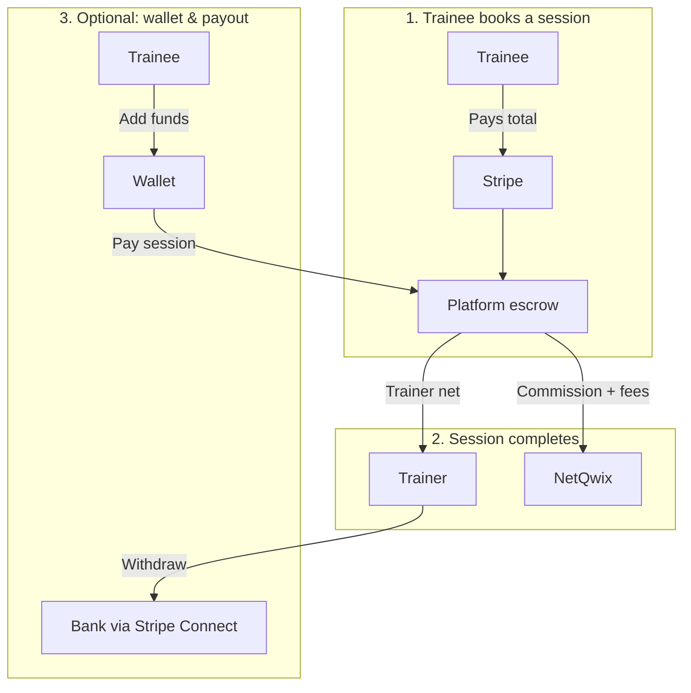

# NetQwix — Payments, Fees & Pricing (US & Canada)

| | |
|---|---|
| **Audience** | Leadership, Finance, Product, Operations |
| **Version** | 2.0 (management edition) |
| **Last updated** | May 28, 2026 |
| **Markets** | United States · Canada only |
| **Payments** | Stripe (Connect, PaymentIntents, Stripe Tax) |
| **Platforms** | Web · Mobile · Admin |

---

## How to use this document

| If you need… | Go to |
|--------------|--------|
| The 2-minute story (who pays what) | [Executive summary](#executive-summary) |
| A dollar example ($100 session) | [Reference transaction](#reference-transaction-100-session) |
| How we set commission | [Commission policy](#commission-policy) |
| What trainees see at checkout | [Trainee checkout](#trainee-checkout-transparency) |
| What trainers earn and withdraw | [Trainer earnings & payouts](#trainer-earnings--payouts) |
| What’s live vs in progress | [Delivery status](#delivery-status) |
| Decisions we still need | [Open decisions](#open-decisions-for-leadership) |
| Engineering / tax detail | [Appendices](#appendix-a-payment-processing-rates) |

---

## Executive summary

NetQwix is a **two-sided marketplace**: trainers set session prices; trainees book and pay; NetQwix holds funds in **escrow** until the session completes, then pays the trainer their **net** share.

### Three money flows

### Policy in one table

| Topic | Policy |
|-------|--------|
| **Trainer list price** | Trainer sets the session fee (e.g. **$100/hr**). This is the anchor for all math. |
| **NetQwix commission** | **% of list price**, taken from the **trainer’s** share — **not** added as a separate line on the trainee receipt. Typical target: **~20%** (admin-configurable). |
| **Platform fees** | Small flat fees per session (default **$0.50** trainee + **$0.50** trainer), admin-editable. |
| **Card / Apple Pay / etc.** | Processing cost is passed to the **trainee** at checkout (NetQwix does not subsidize Stripe on sessions). |
| **Sales tax** | Based on trainee **state/province**; collected via **Stripe Tax** where enabled. |
| **Wallet top-up** | **No** commission on money added to wallet; trainee gets face value credited (Stripe cost handled per finance policy). |
| **Trainer withdrawal** | Target: deduct payout processing (and tax if required) before bank transfer — **in development**. |
| **Regions** | **US → USD** · **CA → CAD** — trainee’s market drives currency and tax. |

### Why this matters for the business

1. **Transparent checkout** builds trainee trust (every fee line item before pay).  
2. **Configurable commission** protects margin while allowing VIP trainer rates.  
3. **Pass-through processing** avoids NetQwix paying Stripe out of commission.  
4. **Escrow + quote snapshot** reduces disputes and supports clean refunds.  
5. **US + CA only** keeps tax and pricing complexity bounded.

---

## Reference transaction: $100 session

**Assumptions:** 1-hour session, trainer list price **$100**, commission **20%**, trainee platform fee **$0.50**, Texas sales tax **8.25%**, US domestic card.

### What the trainee pays

| Line item | Amount | Notes |
|-----------|--------|--------|
| Session price | **$100.00** | Trainer’s published rate |
| Platform fee | **$0.50** | Shown on receipt |
| Card processing | **$3.21** | ~2.9% + $0.30 on charge base |
| Sales tax (TX) | **$8.56** | On taxable subtotal |
| **Total charged** | **$112.27** | Stripe charge amount |

*Commission is **not** listed on the trainee receipt.*

### What the trainer receives (after session)

| Line item | Amount | Notes |
|-----------|--------|--------|
| Session gross | $100.00 | From list price |
| NetQwix commission (20%) | −$20.00 | Deducted at release |
| Trainer platform fee | −$0.50 | Deducted at release |
| **Trainer net** | **$79.50** | Paid to wallet / Connect |

### What NetQwix retains (approximate)

| Component | Amount |
|-----------|--------|
| Commission + both platform fees | $21.00 |
| Less Stripe processing (paid by trainee but nets against platform balance) | −$3.21 |
| Less infrastructure (COGS estimate) | −$0.40 |
| **Approx. platform margin** | **~$17.39** |

> Other US states and Canadian provinces change **tax** and slightly change **total**; commission math stays on the **$100** list price. See [Appendix B](#appendix-b-tax-quick-reference) for tax ranges.

---

## Commission policy

### How commission works

- Commission applies to the **session subtotal** (after promo discounts).  
- It is deducted when funds are **released to the trainer**, not as an extra charge to the trainee.  
- **Promo codes** reduce the subtotal first, then commission is calculated.

### Who sets the rate (priority order)

| Priority | Set by | Applies to |
|----------|--------|------------|
| 1 | **Per-trainer override** | That trainer only (Admin → Manage trainers) |
| 2 | **Global default** | All trainers without an override (Admin dashboard) |
| 3 | **Regional default** | Fallback in Pricing & fees (US / CA tabs) |

**Example:** Global 20%, Trainer A has override 15% → Trainer A pays **15%**, everyone else **20%**.

### Management controls (Admin)

| Control | Location | Purpose |
|---------|----------|---------|
| Global commission % | Admin home | Default for all coaches |
| Per-trainer % | Manage trainers | Negotiated / promotional rates |
| Default & floor % | Pricing & fees → US/CA | Regional fallback and minimum margin guardrail |
| Live preview | Pricing & fees → Quote simulator | See trainee total & trainer net before publishing changes |

### What trainers should see (requirement)

| Screen | Information |
|--------|-------------|
| Profile / earnings | **Your NetQwix commission: X%** (actual resolved rate) |
| Upcoming / completed sessions | Gross, commission $, platform fee, **estimated net** |
| Withdrawal | Requested amount, fees, **net to bank** |

**Status:** Commission math is live in the backend; trainer-facing display still being unified (some apps show static “~20%” copy).

---

## Trainee checkout transparency

Every booking (web + mobile) should show a **line-item receipt** before payment:

| Shown to trainee | Example label |
|------------------|---------------|
| Session price | Session with [Coach name] |
| Discount | Promo code (if any) |
| Platform fee | Platform fee |
| Processing | Card processing fee / Apple Pay fee |
| Tax | Sales tax (TX) · HST (ON) · etc. |
| **Total** | **Total** |

**Not shown to trainee:** commission %, trainer net, trainer-side platform fee.

### Payment methods (by country)

| United States | Canada |
|---------------|--------|
| Credit / debit (US & international rates) | Credit / debit (CA & international rates) |
| Apple Pay, Google Pay | Apple Pay, Google Pay |
| Link, Amazon Pay, Cash App | Link, Interac (if enabled) |
| NetQwix Wallet | NetQwix Wallet (when CA wallet launched) |

**Canada:** Amazon Pay and Cash App are **not** offered.

Processing rates follow [Stripe published pricing](https://stripe.com/pricing) (confirm on our contract). Domestic US card: **2.9% + $0.30**; international cards carry a surcharge. Details in [Appendix A](#appendix-a-payment-processing-rates).

---

## Trainer earnings & payouts

### Session products using this fee stack

| Product | Commission? | Platform fees? |
|---------|-------------|------------------|
| Scheduled 1:1 booking | Yes | Yes |
| Instant lesson | Yes | Yes |
| Session extension | Yes | Yes |
| Storage subscription (coach) | Separate catalog | Configurable |
| Trainee wallet top-up | **No** | **No** |

### Wallet top-up (trainee adds money)

| Rule | Detail |
|------|--------|
| Commission | **None** |
| Platform session fees | **None** |
| Sales tax | **None** (stored value) |
| Credit amount | **$100 added → $100 balance** (recommended UX) |
| Stripe cost | Absorbed by platform on load, or grossed up — **finance sign-off** ([Open decisions](#open-decisions-for-leadership)) |

### Withdrawal to bank (trainer)

| Today | Target |
|-------|--------|
| Full requested amount sent to Stripe Connect | **Quote first:** show processing fee and any required withholding; transfer **net** |
| No breakdown in app | “Withdraw $500 → receive $485” style UI |

**Requires:** CPA input on withholding; engineering payout-quote API.

---

## Markets & currency

| Market | Currency | Wallet today | Tax engine |
|--------|----------|--------------|------------|
| **United States** | USD | Enabled | Stripe Tax (when enabled) + estimates |
| **Canada** | CAD | Planned | Stripe Tax (when enabled) + estimates |

**Rules**

- Canadian trainees checkout in **CAD**; US trainees in **USD**.  
- Tax jurisdiction = trainee **billing address** (state / province).  
- Cross-border (US coach, CA trainee): use conversion or dual list pricing — **dual list pricing recommended** (in roadmap).

---

## Revenue model summary

| Revenue to NetQwix | Typical source |
|--------------------|----------------|
| **Commission %** | Trainer session subtotal |
| **Trainee platform fee** | Flat per session (checkout) |
| **Trainer platform fee** | Flat per session (payout deduction) |
| **Storage plans** | Coach subscriptions ($3 / $5 / $10 USD tiers; CAD equivalents in admin) |
| **Processing** | Passed through to trainee on sessions (not NetQwix revenue) |

### Minimum margin (operations)

Internal **COGS** estimates (video, API, storage) support a **minimum commission floor** so list prices are not set below cost. Admin simulator can preview platform net before changing rates.

---

## Delivery status

| Capability | Status | Notes for leadership |
|------------|--------|----------------------|
| Pricing config & admin hub | **Live** | US/CA fees, payment grids, simulator, version history |
| Quote before checkout | **Live** | Web + mobile sessions |
| Commission (global + per-trainer) | **Live** | Backend resolution |
| Processing fee to trainee | **Live** | Default on |
| Escrow fee snapshot | **Live** | Auditable per booking |
| Trainee line-item receipt | **Mostly live** | Some flows still catching up |
| Stripe Tax (authoritative) | **Configurable** | Requires registrations + env flag |
| Trainer sees exact commission % | **In progress** | API + UI |
| Trainer withdrawal fee quote | **Not started** | Needs finance + CPA |
| Canada wallet | **Not started** | Config ready |
| Dual USD/CAD coach rates | **Not started** | Recommended for CA launch |

### Phased roadmap

| Phase | Focus | Business outcome |
|-------|--------|------------------|
| **Done** | Quote engine, admin pricing, escrow breakdown | Correct charges & admin control |
| **Now (P0)** | Trainer commission display, checkout parity, intl card re-quote | Trust & fewer support tickets |
| **Next (P1)** | Payout quote with fees | Sustainable trainer cash-out |
| **Then (P2)** | CAD wallet, dual list prices | Canada launch readiness |
| **Ongoing** | Stripe Tax registrations, CPA sign-off | Compliance |

---

## Open decisions for leadership

| # | Decision | Options | Owner |
|---|----------|---------|-------|
| 1 | **Default commission %** at launch | e.g. 15% vs 20% | Leadership / Finance |
| 2 | **Wallet top-up Stripe cost** | A) Trainee pays $100, gets $100 (platform absorbs Stripe) · B) Net credit after Stripe | Finance |
| 3 | **Trainer payout fees** | Which Connect/ACH fees to pass to trainer vs absorb | Finance + CPA |
| 4 | **Canada go-live** | Dual list price vs FX conversion | Product |
| 5 | **Stripe Tax scope** | Which US states + CA registrations first | Tax advisor |
| 6 | **Group classes** | Commission on total vs per-seat | Product |

---

## Compliance & sign-off checklist

| Item | Status |
|------|--------|
| Stripe US & CA pricing verified on dashboard | ☐ |
| Stripe Tax registrations (US nexus + CA GST/HST/QST) | ☐ |
| CPA / tax advisor — marketplace facilitator (US) + B2C services (CA) | ☐ |
| Terms of Service — fees, tax, processing by region | ☐ |
| Global commission % set in admin before launch | ☐ |
| End-to-end test: US booking, CA booking, refund | ☐ |
| Trainer payout fee policy documented | ☐ |

---

## Glossary

| Term | Meaning |
|------|---------|
| **List price** | Coach-published session price (e.g. $100/hr) |
| **Commission** | NetQwix % taken from coach earnings on that list price |
| **Platform fee** | Flat per-session fee (trainee side and/or coach side) |
| **Processing fee** | Stripe cost for card/wallet rails |
| **Escrow** | Funds held until session completes |
| **Quote** | Itemized price computed before payment; locked at booking |
| **HST / GST / PST / QST** | Canadian sales taxes |
| **Sales tax** | US state + local transaction tax |

---

# Appendices

*The following sections support Finance, Legal, and Engineering. They are not required for executive review.*

---

## Appendix A: Payment processing rates

### United States (representative)

| Method | Variable | Fixed (USD) |
|--------|----------|-------------|
| US card | 2.90% | $0.30 |
| Non-US card on US charge | 4.40% | $0.30 |
| Apple Pay / Google Pay / Link / Amazon Pay / Cash App | Same as underlying card | |
| NetQwix Wallet (at session) | 0% | $0.00 |

### Canada (representative)

| Method | Variable | Fixed (CAD) |
|--------|----------|-------------|
| Canadian card | 2.90% | C$0.30 |
| Non-CA card on CAD charge | 3.70% | C$0.30 |
| Apple Pay / Google Pay / Link / Interac | Same as underlying card | |
| NetQwix Wallet | 0% | C$0.00 |

**Not in Canada:** Amazon Pay, Cash App.

Confirm all rates on the [Stripe dashboard](https://dashboard.stripe.com) contract.

---

## Appendix B: Tax quick reference

### United States

- **Engine:** Stripe Tax (recommended) with billing address.  
- **Rates:** 0%–~10.25%+ by state/locality (e.g. TX **8.25%**, OR **0%**).  
- **Wallet top-up:** Not taxable (stored value).  
- **Action:** CPA review for marketplace facilitator nexus by state.

### Canada

- **Engine:** Stripe Tax with GST/HST (+ QST in Quebec).  
- **Examples:** ON HST **13%** · AB GST **5%** · BC **12%** · QC **~14.975%**.  
- **Small supplier:** GST/HST registration often required above **C$30,000** revenue.  
- **Action:** Register GST/HST; separate QST in Quebec if applicable.

---

## Appendix C: Session totals quick reference

*Based on $100 USD session, 15% commission in table below; use [Reference transaction](#reference-transaction-100-session) for **20%** example.*

### USA — $100 session

| Payment | Tax (example) | Processing | Tax $ | **Trainee total** |
|---------|---------------|------------|-------|-------------------|
| US card | Texas 8.25% | $3.21 | $8.56 | **$112.27** |
| US card | California 9.5% | $3.20 | $9.80 | **$113.00** |
| US card | Oregon 0% | $3.20 | $0.00 | **$103.20** |
| International card | Texas 8.25% | $4.70 | $8.64 | **$113.34** |
| Wallet only | Texas 8.25% | $0.00 | $8.25 | **$108.25** |

### Canada — C$135 session (15% commission)

| Province | Processing | Tax | **Trainee total** |
|----------|------------|-----|-------------------|
| ON (13% HST) | C$4.22 | C$18.10 | **C$157.32** |
| AB (5% GST) | C$4.22 | C$6.96 | **C$146.18** |
| BC (12%) | C$4.22 | C$16.71 | **C$155.93** |
| QC (14.975%) | C$4.22 | C$20.85 | **C$160.07** |

### Storage (example — Plus plan)

| Market | List | Approx. total/mo |
|--------|------|------------------|
| US (TX tax) | $3.00 | ~$3.67 |
| CA (ON HST) | C$4.00 | ~C$4.99 |

---

## Appendix D: Admin configuration map

| Business setting | Admin location |
|------------------|----------------|
| Global commission % | Admin home |
| Per-trainer commission % | Manage trainers |
| US/CA platform fees, default commission, processing toggle | Pricing & fees |
| Payment method rates | Pricing & fees → US/CA grids |
| Preview impact | Pricing & fees → Quote simulator |
| Booking fee audit | Finance → booking detail / escrow columns |

Default technical values (e.g. 15% in seed config) are overridden by admin publishes — **set production % before launch**.

---

## Appendix E: Edge cases (operations)

| Category | Scenario | Rule |
|----------|----------|------|
| **Commission** | Trainer override vs global | Trainer wins |
| **Commission** | Rate changed after booking | Quote **snapshot** at booking time |
| **Commission** | 0% override | Allowed if explicitly set |
| **Checkout** | International card | Higher processing; re-quote when card known |
| **Checkout** | Wallet pays full session | No processing at session |
| **Checkout** | Wallet + card split | Prorate processing on card portion — *to build* |
| **Tax** | No address yet | Estimated tax; final at Stripe Tax |
| **Tax** | Refund after payment | Refund total paid; tax reversal via Stripe |
| **Escrow** | Session cancelled | Refund per policy; claw back coach portion |
| **Escrow** | Dispute / chargeback | Freeze; manual admin |
| **Wallet** | Top-up fails | No balance credit |
| **Payout** | No Stripe Connect | Block bank payout; onboarding CTA |
| **Cross-border** | US coach, CA trainee | CAD checkout; dual list price recommended |

Full engineering checklist available in repo implementation tracking.

---

## Appendix F: Technical reference (engineering)

| Item | Detail |
|------|--------|
| Quote API | `POST /payments/quote` |
| Admin config API | `GET/PUT /admin/pricing-config` |
| Commission resolution | `trainer.commission` → `admin_setting.commission` → `pricing_config` regional default |
| Key modules | `pricingService.ts`, `stripe.ts`, `escrowService.ts`, `topUpService.ts`, `payoutService.ts` |
| Feature flags | `PRICING_QUOTE_ENABLED`, `STRIPE_TAX_ENABLED`, `WALLET_ENABLED` |
| Escrow metadata | Snapshots subtotal, commission, fees, tax, trainer net at charge time |

---

*Document owner: Product / Engineering · Questions: link PRs to this file and update [Delivery status](#delivery-status) when capabilities ship.*
