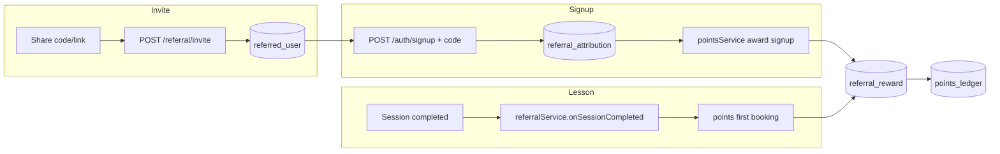

# NetQwix referral system

Application-level referrals for **Trainer ↔ Trainee** in any direction. Rewards are **points** (redeem in Wallet: **100 pts = $5**). See [POINTS_SYSTEM.md](./POINTS_SYSTEM.md).

**Checkout:** Dollar referral discounts and first-lesson $ off are **disabled**. Promos still apply at checkout; referral value is points only.

## Who can refer whom

| Referrer | Can invite to join as |
|----------|------------------------|
| Trainer  | Trainee or Trainer     |
| Trainee  | Trainee or Trainer     |

## Reward matrix (points, default)

Configurable via `src/config/points.ts` (`referralMatrixPoints`). Per-event cap **5 points**.

| Referrer → Referee | Referrer signup | Referee signup | Referrer first booking |
|--------------------|-----------------|----------------|------------------------|
| Trainer → Trainee  | 5               | 3              | 5                      |
| Trainer → Trainer  | 5               | —              | —                      |
| Trainee → Trainee  | 3               | 3              | 5                      |
| Trainee → Trainer  | 5               | 3              | —                      |

**First booking** = referee’s first **completed** session in their **registered role** (trainee completions count only for trainee referees; trainer only for trainer referees). Paid once to the referrer.

## Architecture

### API (`/referral`)

| Method | Path | Auth | Description |
|--------|------|------|-------------|
| GET | `/program` | Yes | Code, links, `rewardMatrixPoints`, stats |
| GET | `/resolve/:code` | No | Public preview (`rewardPreviewPoints`) |
| POST | `/invite` | Yes | `{ emails[], targetAccountType }` |
| GET | `/benefits` | Yes | Points program info (no $ checkout discount) |
| POST | `/preview-checkout` | Yes | Promo only; `referralDiscount: 0` |

### Admin (`/admin/referrals`)

| Method | Path | Description |
|--------|------|-------------|
| GET | `/dashboard` | Points issued, redemptions, matrix |
| GET | `/rewards` | Paginated reward ledger |
| GET | `/attributions` | Paginated attributions |

Admin UI: **Revenue & growth → Referrals** (`/apps/referrals`).

### Guards

- No self-referral; one attribution per referee
- Idempotent referral + points ledger keys
- Hibernating / pending-deletion / deleted users cannot earn or redeem points
- Cancel/refund: session activity points clawed back; promo usage reverted; first-booking referral reversed when applicable

### Legacy

- `rewardMatrix` on `/program` is deprecated ($ preview only).
- Existing **wallet** referral credits from before the points migration remain spendable.
