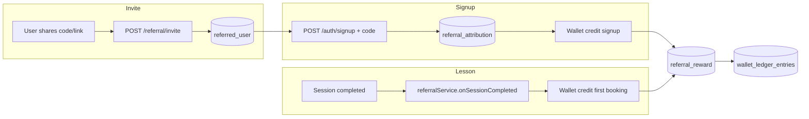

# NetQwix referral system

Application-level referrals for **Trainer ↔ Trainee** in any direction. Rewards are wallet credits (USD minor units) issued through the existing double-entry ledger.

## Who can refer whom

| Referrer | Can invite to join as |
|----------|------------------------|
| Trainer  | Trainee or Trainer     |
| Trainee  | Trainee or Trainer     |

There is no separate “role lock”: the inviter chooses **target account type** per invite batch. The referee picks **Trainer** or **Trainee** at signup; rewards use the actual referrer/referee account types.

## Reward matrix (default USD cents)

Configurable via env vars (`REFERRAL_SIGNUP_*_MINOR`, `REFERRAL_FIRST_BOOKING_*_MINOR`). See `src/config/referral.ts`.

| Referrer → Referee | Referrer signup | Referee signup | Referrer first booking |
|--------------------|-----------------|----------------|------------------------|
| Trainer → Trainee  | $10             | $10            | $15                    |
| Trainer → Trainer  | $20             | —              | —                      |
| Trainee → Trainee  | $5              | $5             | $10                    |
| Trainee → Trainer  | $15             | $10            | —                      |

**First booking** = referee’s first **completed** session (as trainee or trainer on that booking). Paid once to the referrer.

### First lesson checkout discount (stacks with promo)

Referred **trainees** who have not completed a lesson yet get an automatic checkout discount on their **first** scheduled or instant booking. This is separate from wallet signup credits and **stacks** with promo codes (promo applies first, then referral discount on the remainder).

| Setting | Default | Env |
|---------|---------|-----|
| Enabled | yes | `REFERRAL_FIRST_LESSON_DISCOUNT_ENABLED` |
| Type | `$15` fixed | `REFERRAL_FIRST_LESSON_DISCOUNT_DOLLARS` or `REFERRAL_FIRST_LESSON_DISCOUNT_PERCENT` |
| Max cap | `$25` | `REFERRAL_FIRST_LESSON_MAX_DISCOUNT_DOLLARS` |

Preview: `POST /referral/preview-checkout` with `{ amount, booking_type, coupon_code? }`.

## Architecture

### Collections

| Collection | Purpose |
|------------|---------|
| `referred_user` | Email invites (pending → registered → qualified) |
| `referral_attribution` | One row per referee user (who referred whom) |
| `referral_reward` | Audit of each credit/skipped/failed payout |
| `user.referral_code` | Shareable code (`NQ` + 6 chars) |
| `user.referred_by_user_id` | Denormalized referrer on referee |

### API (`/referral`)

| Method | Path | Auth | Description |
|--------|------|------|-------------|
| GET | `/program` | Yes | Code, links, stats, reward matrix |
| GET | `/resolve/:code` | No | Public preview for signup |
| GET | `/resolve-referrer/:userId` | No | Legacy `?ref=userId` support |
| POST | `/invite` | Yes | `{ emails[], targetAccountType }` |
| GET | `/invites` | Yes | Invite history (same data as `/user/my-referrals`) |
| GET | `/rewards` | Yes | Credit history |
| GET | `/benefits` | Yes | Referee eligibility (first-lesson discount) |
| POST | `/preview-checkout` | Yes | Promo + referral stacked price preview |

### Admin (`/admin/referrals`)

| Method | Path | Description |
|--------|------|-------------|
| GET | `/dashboard` | Totals, matrix, recent rewards & attributions |
| GET | `/rewards` | Paginated reward ledger |
| GET | `/attributions` | Paginated attributions |

Admin UI: **Revenue & growth → Referrals** (`/apps/referrals`).

Legacy routes kept:

- `POST /user/invite-friend` — `{ user_email, targetAccountType? }`
- `GET /user/my-referrals`

### Mobile

- **Invite friends** screen: target type (trainee/trainer), reward amounts, share link with `?code=`
- **Signup**: passes `referral_code` / `referrer_id` from deep link

### Guards

- No self-referral
- One attribution per referee
- Email already registered → invite rejected
- Email already invited by another member → rejected
- Idempotent ledger keys per reward
- If `WALLET_ENABLED=false`, rewards recorded as `skipped` (not lost)

### Ops

- Toggle: `REFERRAL_ENABLED=false`
- Currency: `REFERRAL_CURRENCY=USD`
- Finance review: `GET /referral/rewards` + `wallet_ledger_entries` where `reference_type=referral`
